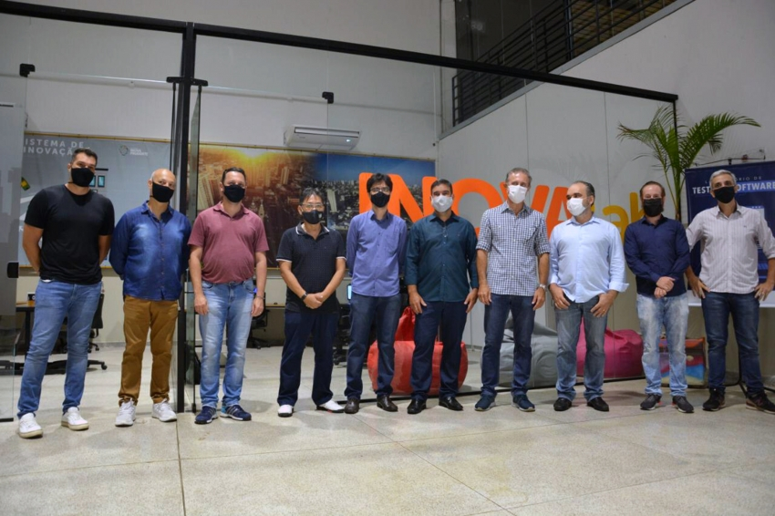
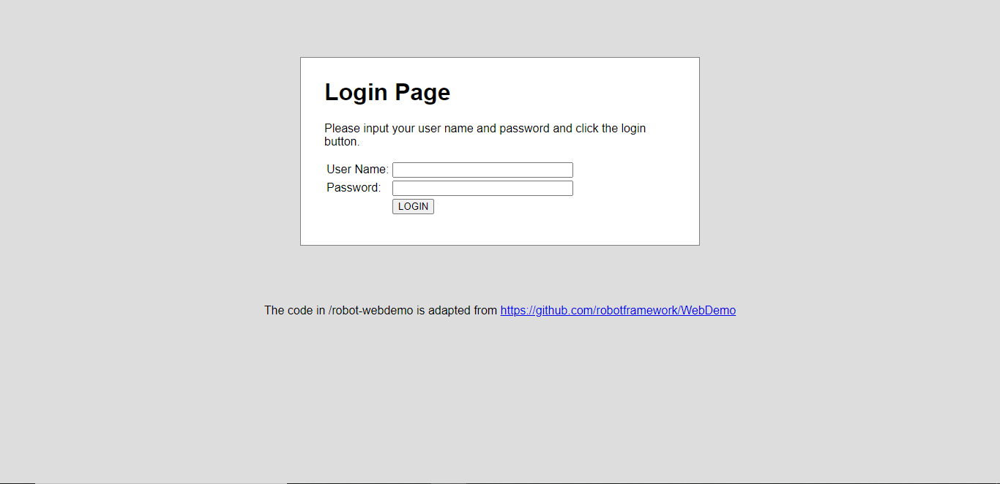

# Manual do InovaLab - Laboratório de Teste de Software

## Editado por:
- David Hiromi Ono - estagiário da SETEC e aluno da FCT UNESP;
- Pedro Henrique Zago Costa - estagiário da SETEC e aluno da FCT UNESP;
- André Takeshi Endo - orientador e supervisor do laboratório e docente da UTFPR. 

## Introdução

Situado na Fundação Inova Prudente, o Laboratório de Testes de Software foi inaugurado no dia 04 de Dezembro de 2020, tendo a presença de 
diversos empresários, o repesentante da UNESP - professor doutor Ronaldo Correia, o ex-prefeito Nelson Bugalho, o ex-secretário de Tecnologia Rogério Alessi 
e o ex-diretor do Inova Prudente, Bruno Carnelóss.

https://www.inovaprudente.com.br/noticias/empresarios-e-comunidade-dev-ganham-laboratorio-de-testes-de-software.html

Inagurado com 2 servidores e 3 computadores para serem usados nos testes, o InovaLab conta com um excelente espaço para que qualquer pessoa, 
desde os interessados em saber como funciona o local, até desenvolvedores que venham a usar o espaço. Assim como consultar os estagiários presentes
em qualquer dúvida sobre o local ou o que acontece no mesmo. 

## Direção e Equipe

 - Prefeito Atual: Edson Tomazini;
 - Diretor do Inova: Diego Andreasi;
 - Orientador do Projeto: André Endo;
 - Estagiários: David Ono e Pedro Zago.

## Coordenação, Controle de Tarefas e Comunicação

O InovaLab é coordenado pelo professor doutor André Takeshi Endo, monitorado e mantido pelos estágiarios da SETEC, David Ono e Pedro Zago. 
E como a orientação é feita à distância, tem se um controle das tarefas realizadas e em andamento através de um canal do Discord. 
Nele é registrado cada atividade realizada diariamente pelos estagiários e todas as informações importantes voltadas ao laboratório. 
E além disso, a comunicação é realizada em formato de reuniões semanais, sempre feitas pelo Google Meet. Desse modo, se tem 
uma visão mais detalhada de como anda o processo das tarefas. 

## Treinamento

 - Foi apresentado para os estagiários um E-Book sobre Teste de Software, chamado "Software Testing: From Theory to Practice" no link: https://sttp.site/
 - A disciplina promovido por André Endo na UTFPR, Teste de Software disponibilizado no Moodle da Universidade.
 - Curso de Robot Framework: https://testautomationu.applitools.com/robot-framework-tutorial/
 - Curso de Selenium IDE: https://testautomationu.applitools.com/codeless-test-automation-with-selenium-ide/
 - Diversos outros conteúdos ocasionais.
 
 ### Casos de Teste

Os Casos de teste são modelos exemplos do que pode ser feito utilizando o espaço e os equipamentos do InovaLab. Tendo tais testes 
prontos, pode se receber visitantes inusitados e até mesmo pessoas curiosas com o que é feito no local de trabalho. 
Desse modo, foi usado a aplicação Pet Clinic para se fazer os Casos de Testes, sendo alguns:

 - Navegação entre as páginas;
 - Busca de Proprietarios listados; 
 - Adição e confirmação de Proprietarios. 
 
 

Além disso, tem-se o Deploy feito por André Endo, no link https://andreendo.github.io/robot-webdemo/ para ser usado como Teste de Caso
utilizando o Robot Framework, e desse modo fazer testes em logins.

Por Fim, os futuros testes de casos serão usados as VMs em https://github.com/guimattiello/MoLeWe#experimental-package.

## Consultoria

- O InovaLab presta o serviço de desenvolvimento de testes de software automatizados para as empresas residentes da Fundação Inova Prudente que trabalham com softwares suportados pelos programas de automatização de testes dos computadores do laboratório. É desenvolvido alguns casos de teste que possam sanar os sintomas apresentados pela empresa, além de um material de apoio e consultoria para que a mesma possa dar continuidade ao trabalho, baseado no que foi desenvolvido e entregue à ela pelo laboratório. Este serviço conta com um documento de confidencialidade.
- Futuramente, é possível que o serviço seja estendido para empresas além daquelas hospedadas na Fundação Inova Prudente.
- Para empresas que trabalham com softwares não suportados pelos computadores do InovaLab, é prestado o serviço de consultoria, onde são sugeridas ferramentas e técnicas que possam ser utilizadas para a automatização dos testes de software do produto em questão.
- O InovaLab está aberto e à disposição, para qualquer residente de Presidente Prudente que tenha interesse, visitar no horário de funcionamento (até o final da pandemia COVID-19, o acesso à Fundação Inova Prudente pode estar restrita, dependendo da situação da cidade).

## Palestras

O InovaLab tem a intenção de oferecer palestras e workshops com o intuíto de compartilhar os serviçoes prestados nele, e as fundações e benefícios do teste de software para a população de Presidente Prudente e região.
- Já contamos com uma palestra inicial realizada: "Fundamentos de Teste de Software" - ministrada pelo professor doutor André Takeshi Endo, em 17 de dezembro de 2020. 
  https://www.inovaprudente.com.br/noticias/primeira-palestra-do-inovalab-aborda-fundamentos-do-teste-de-software.html
